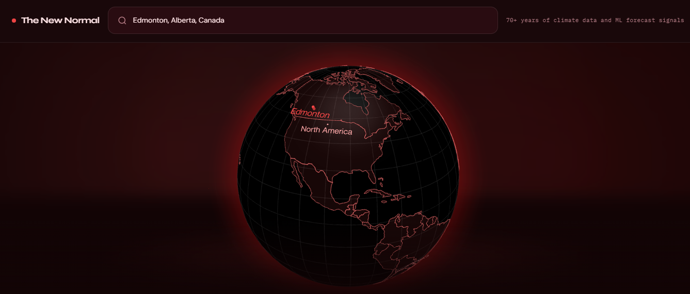
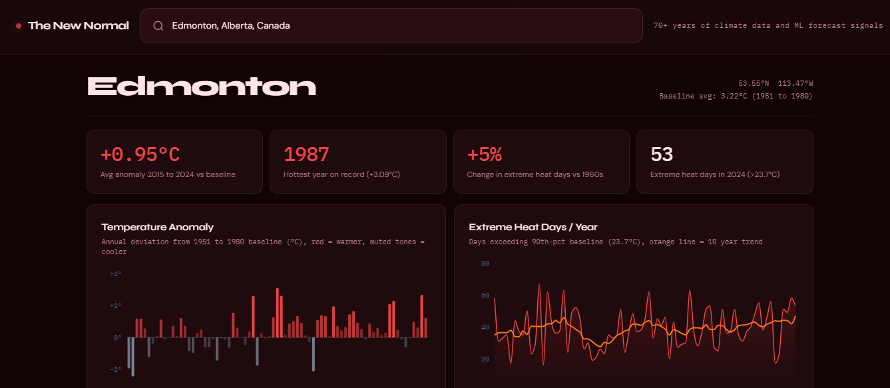
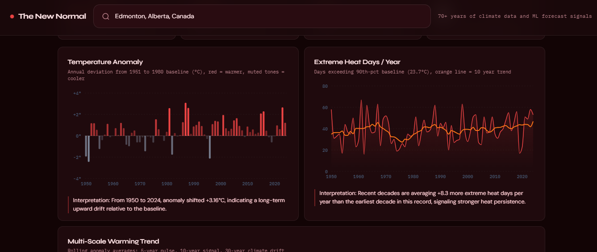
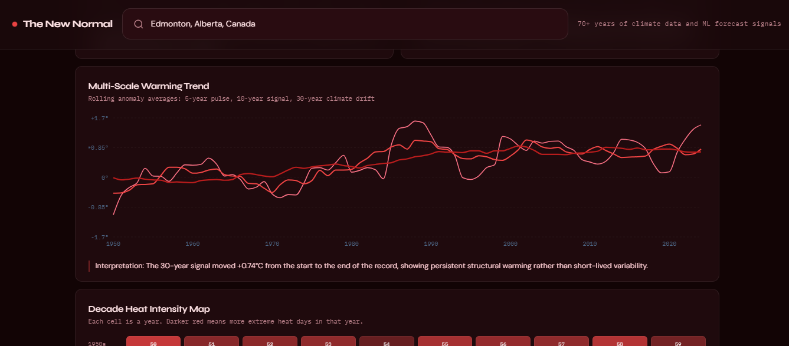
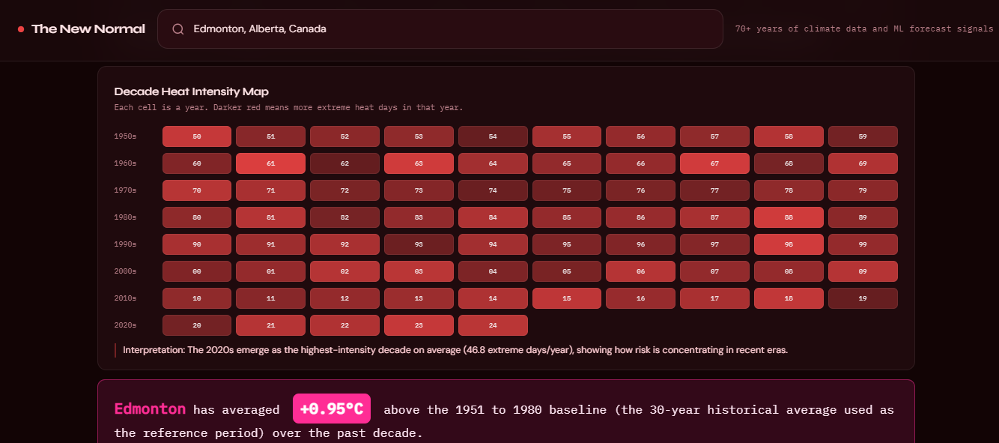
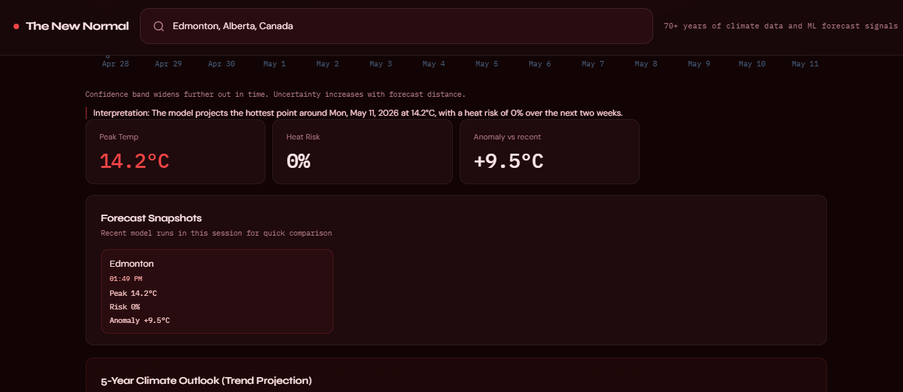
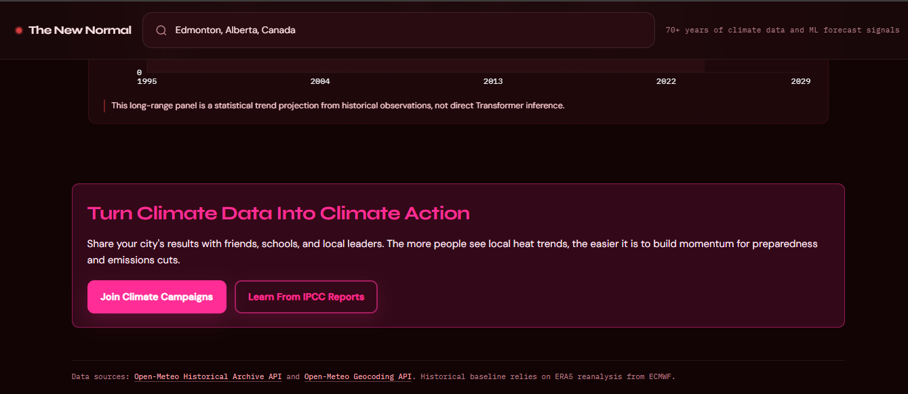

# The New Normal | Hackathon Submission

Project name: The New Normal
Event: Tech Builder Program — Hackathon 2026

Short description
-----------------
The New Normal is an interactive, city-focused climate evidence tool that turns raw historical weather data into simple, personal answers.
 Is your city hotter than it used to be? It uses the Open‑Meteo archive to compute year-by-year temperature anomalies against the 1951–1980 scientific baseline and visualizes the results with clear charts and a live 3D globe.

Screenshots
-----------

Problem statement 
-----------------------------------
People lack an accessible, personalized tool to verify whether the extreme weather they are experiencing is statistically anomalous. Climate datasets are available, but they are scattered, technical, and difficult for non-experts to interpret. That creates a credibility gap and reduces public engagement with local climate impacts.

The New Normal solves this by providing a one-click city lookup that produces scientifically grounded local metrics (annual anomalies, extreme days, trend projections) and plain-English summaries that anyone can understand and act upon.

Core features
-------------
- City search (Open‑Meteo geocoding) with autocomplete
- Interactive 3D globe that flies to the selected city
- Temperature anomaly bar chart (1950–2024 vs 1951–1980 baseline)
- Extreme heat days per year with a 10-year moving average
- Auto-generated plain-English insight summary for each city
- 14-day local forecast (Transformer model) and a 5-year statistical outlook

Solution overview
-----------------
Design goals
- Make scientific data personal and local
- Avoid overwhelming users with jargon; emphasize clear visuals and a one-sentence takeaway
- Use free public data sources so anyone can reproduce the results

Data pipeline (brief)
- Geocode city → lat/lon (Open‑Meteo Geocoding API)
- Fetch daily max/min temperatures for 1950–2024 (Open‑Meteo Archive API)
- Clean daily records, compute yearly averages and yearly max lists
- Baseline (1951–1980) computed from the archive; anomaly = yearAvg − baselineAvg
- 90th-percentile of baseline daily maxes used as the local extreme-day threshold

Architecture & tech
-------------------
- Frontend: React + Vite (fast dev), Recharts for visualizations, react-globe.gl for globe
- Styling: Tailwind + custom CSS (dark theme with high-contrast data accents)
- Backend: Optional FastAPI scaffold exists in `/backend` (model-serving & experiments)
- Data: Open‑Meteo (historical and geocoding)

Notes: model artifacts are expected in `backend/ml/saved_model/` if you want Transformer inference. The API returns 503 when artifacts are missing so it won't crash the server.

Team & credits
---------------
Contributors:
- Tj Baja AKA tbajajUofA

Data & license
--------------
Data: Open‑Meteo Archive API (ERA5 reanalysis)
License: MIT (this repo)

