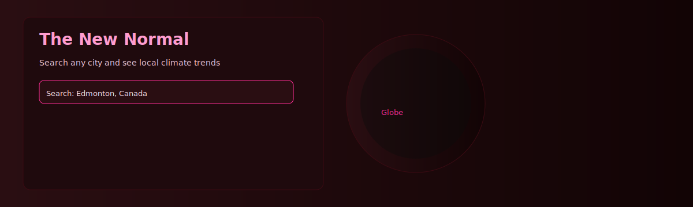
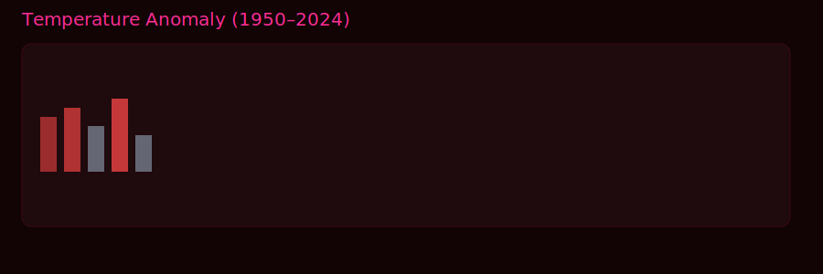
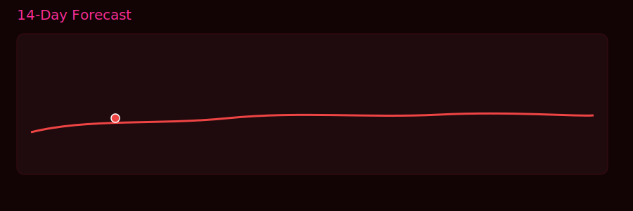
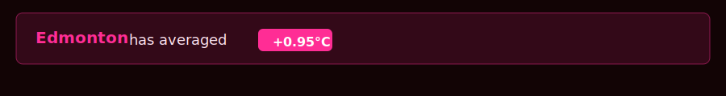

# The New Normal — Hackathon Submission

Project name: The New Normal
Event: Tech Builder Program — Hackathon 2026

Short description
-----------------
The New Normal is an interactive, city-focused climate evidence tool that turns raw historical weather data into simple, personal answers: is your city hotter than it used to be? It uses the Open‑Meteo archive to compute year-by-year temperature anomalies against the 1951–1980 scientific baseline and visualizes the results with clear charts and a live 3D globe.

Screenshots
-----------
Include screenshots in `docs/screenshots/` (create the folder and add images). Suggested files:

-- `docs/screenshots/hero.svg` — full-width hero showing globe + search
-- `docs/screenshots/anomaly-bar.svg` — temperature anomaly bar chart
-- `docs/screenshots/forecast.svg` — 14-day forecast chart
-- `docs/screenshots/insight.svg` — highlighted insight bar with summary

Example markdown to include images here (replace paths with your actual files):






Problem statement (submission-ready)
-----------------------------------
People lack an accessible, personalized tool to verify whether the extreme weather they are experiencing is statistically anomalous. Climate datasets are available, but they are scattered, technical, and difficult for non-experts to interpret. That creates a credibility gap and reduces public engagement with local climate impacts.

The New Normal solves this by providing a one-click city lookup that produces scientifically grounded local metrics (annual anomalies, extreme days, trend projections) and plain-English summaries that anyone can understand and act upon.

Core features
-------------
- City search (Open‑Meteo geocoding) with autocomplete
- Interactive 3D globe that flies to the selected city
- Temperature anomaly bar chart (1950–2024 vs 1951–1980 baseline)
- Extreme heat days per year with a 10-year moving average
- Auto-generated plain-English insight summary for each city
- 14-day local forecast (Transformer model) and a 5-year statistical outlook

What we built (submission checklist)
-----------------------------------
1. Problem statement — this README contains a concise problem definition.
2. Solution overview — design, data sources, and approach are described below.
3. Implementation — working React app with all client-side visuals (see Run section).
4. Codebase — this repository (link provided in your Devpost submission).
5. Documentation — this README + in-code comments.
6. Practical relevance — personalized evidence for public awareness and local planning.
7. Team information — add your name(s) at the end of this README.

Solution overview
-----------------
Design goals
- Make scientific data personal and local
- Avoid overwhelming users with jargon; emphasize clear visuals and a one-sentence takeaway
- Use free public data sources so anyone can reproduce the results

Data pipeline (brief)
- Geocode city → lat/lon (Open‑Meteo Geocoding API)
- Fetch daily max/min temperatures for 1950–2024 (Open‑Meteo Archive API)
- Clean daily records, compute yearly averages and yearly max lists
- Baseline (1951–1980) computed from the archive; anomaly = yearAvg − baselineAvg
- 90th-percentile of baseline daily maxes used as the local extreme-day threshold

Architecture & tech
-------------------
- Frontend: React + Vite (fast dev), Recharts for visualizations, react-globe.gl for globe
- Styling: Tailwind + custom CSS (dark theme with high-contrast data accents)
- Backend: Optional FastAPI scaffold exists in `/backend` (model-serving & experiments)
- Data: Open‑Meteo (historical and geocoding)

How to run (local dev)
----------------------
Prerequisites: Node 18+, npm

1. Install dependencies

```bash
npm install
```

2. Run dev server

```bash
npm run dev
```

3. Build for production

```bash
npm run build
```

Backend (optional)
------------------
The repo contains a small FastAPI backend scaffold under `/backend` used for model inference and local experiments. The frontend works without the backend (it fetches Open‑Meteo directly). If you want to run the backend:

```bash
python -m venv backend/.venv
source backend/.venv/bin/activate
pip install -r backend/requirements.txt
uvicorn backend.app.main:app --reload --port 8000
```

Notes: model artifacts are expected in `backend/ml/saved_model/` if you want Transformer inference. The API returns 503 when artifacts are missing so it won't crash the server.

Testing
-------
Some basic pytest tests live under `backend/tests/`. Run them with:

```bash
python -m pytest backend/tests
```

What to include in your Devpost submission
----------------------------------------
- Short project summary (one paragraph)
- Problem statement (above)
- Demo screenshots (add to `docs/screenshots` and reference here)
- Link to code repository (this repo)
- Instructions to run locally (above)
- One or two short demo videos (optional)

Team & credits
---------------
Contributors:
- Your Name — role (e.g., frontend, data, modeling)

Data & license
--------------
Data: Open‑Meteo Archive API (ERA5 reanalysis)
License: MIT (this repo)

Contact
-------
For questions or to request export-ready screenshots/videos, email: your-email@example.com

Good luck at Tech Builders — if you want, I can:
- Capture and add the actual screenshots into `docs/screenshots/` for you
- Create a 1–2 minute demo GIF or MP4
- Draft the short Devpost description and judging notes
