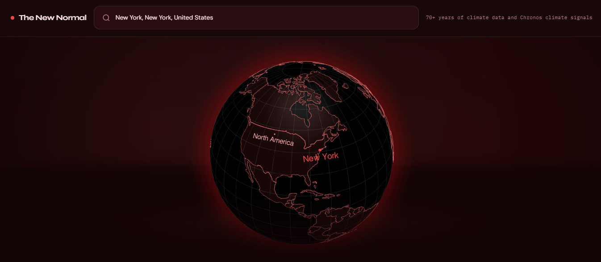
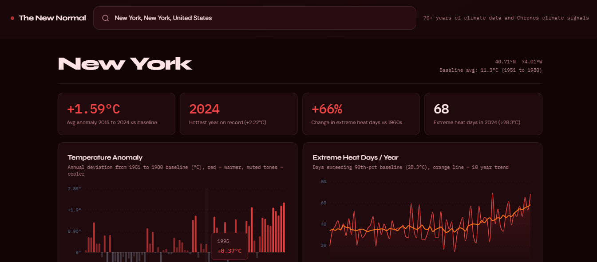
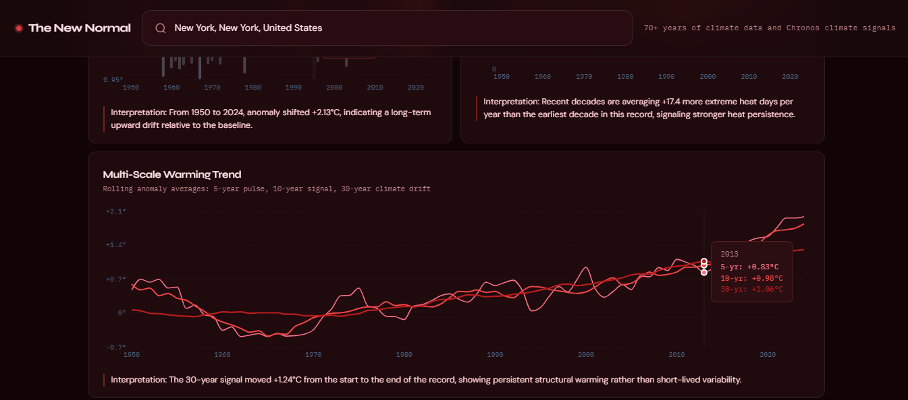
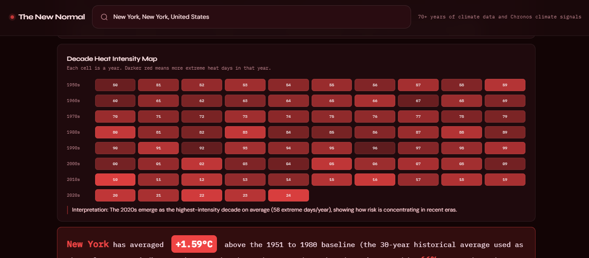
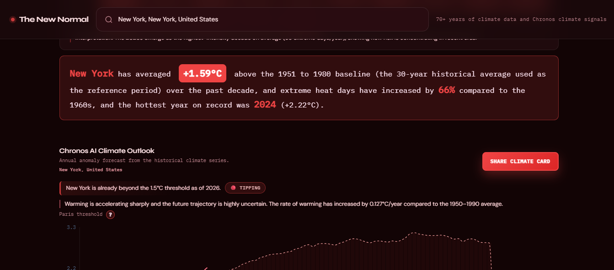
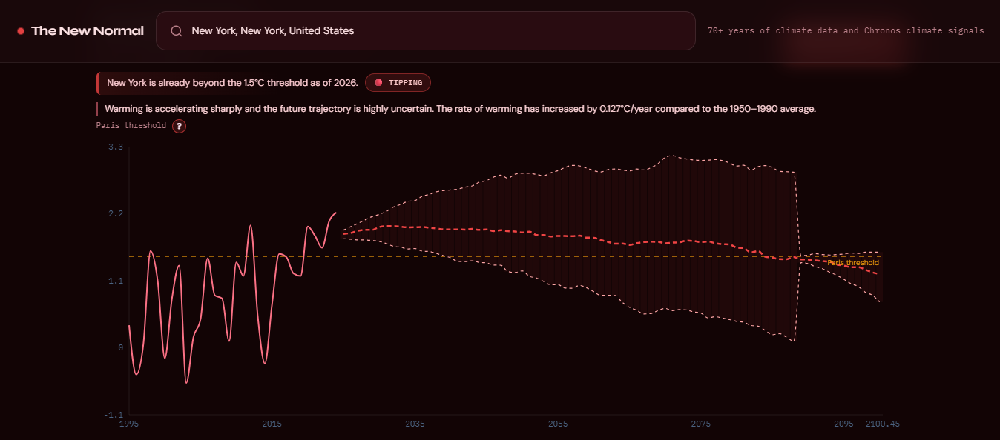
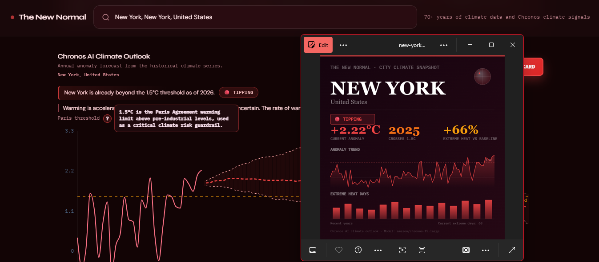
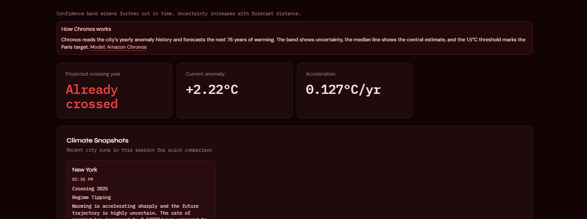
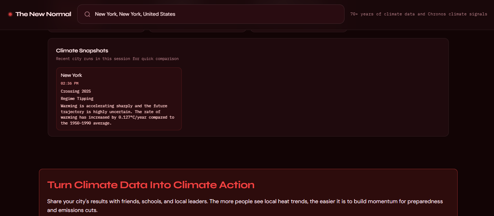
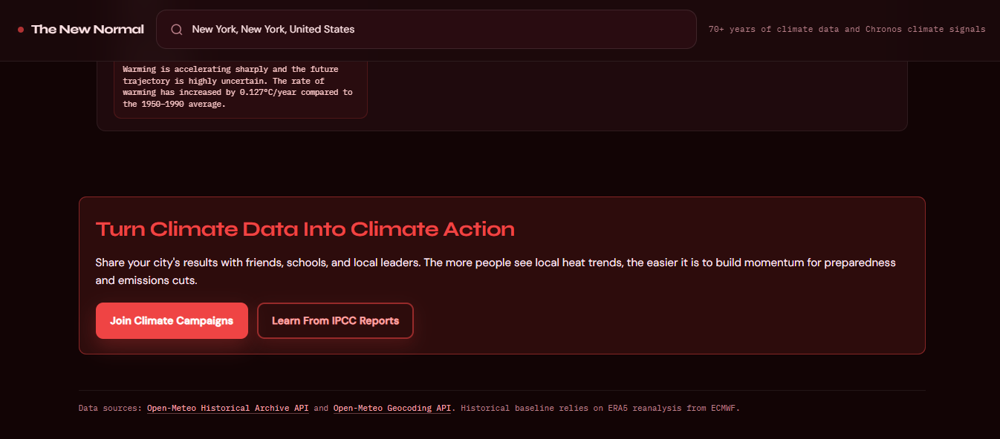

# The New Normal | Hackspire Hackathon 2026 Submission

## Description
The New Normal is an interactive, city-focused climate evidence tool that turns raw historical weather data into clear, personal answers.

It helps answer a simple question: **Is your city hotter than it used to be?**  
The app uses the Open-Meteo archive to compute year-by-year temperature anomalies against the 1951-1980 baseline, then visualizes the results through charts, summaries, and a live 3D globe.

## Demo
https://github.com/user-attachments/assets/43f37a12-bd21-49af-a39d-5f7eb76908e4

## Screenshots

## Problem Statement
People need an accessible, personalized way to verify whether the extreme weather they are experiencing is statistically unusual.

Climate datasets exist, but they are often scattered, technical, and difficult for non-experts to interpret. That creates a credibility gap and reduces engagement with local climate risk.

The New Normal addresses this with one-click city lookup, scientifically grounded local metrics (anomalies, extreme heat, trend signals), and plain-language summaries.

## Core Features
- City search with autocomplete (Open-Meteo geocoding)
- Interactive 3D globe that flies to the selected city
- Temperature anomaly charts (1950-2024 vs 1951-1980 baseline)
- Extreme heat days with moving averages
- Auto-generated plain-English city insight
- Chronos AI-powered climate outlook with:
  - 1.5C crossing signal
  - warming regime classification
  - uncertainty bands
- Downloadable city share card

## Solution Overview
### Design Goals
- Make climate data personal and local
- Keep explanations legible for non-experts
- Use reproducible, free public data sources

### Data Pipeline (Brief)
- Geocode city name to lat/lon via Open-Meteo Geocoding API
- Fetch daily max/min temperatures for 1950-2024 via Open-Meteo Archive API
- Clean daily records and aggregate yearly means/extreme-day counts
- Compute baseline from 1951-1980
- Compute yearly anomaly as `yearAvg - baselineAvg`
- Use the baseline-period 90th percentile of daily max temps as the local extreme-heat threshold

## Architecture & Tech
- Frontend: React + Vite
- Charts/visuals: Recharts, react-globe.gl
- Styling: Tailwind + custom CSS
- Backend: FastAPI service in `backend/` for inference endpoints
- Data source: Open-Meteo (historical + geocoding)
- Model: Amazon Chronos (`chronos-t5-small`) running on CPU

Backend notes: the service warms Chronos on startup and serves `/api/climate/crossing`, `/api/climate/regime`, and `/api/climate/crossing/stream`.

## APIs Used
- **Open-Meteo Geocoding API** for city lookup and coordinates
- **Open-Meteo Archive API** for historical daily temperatures (1950-2024)
- **Open-Meteo Forecast API** for optional contextual exploration
- **Local model inference** (Chronos T5 small) for annual anomaly trajectory forecasting

## Visualizations (Components)
- `SearchBar`: city lookup + autocomplete
- `Globe`: spatial context and camera fly-to
- `AnomalyChart`: yearly anomaly visualization
- `AnomalyTrendChart`: long-term warming trend views
- `DecadeHeatmap`: decadal/seasonal pattern view
- `HeatDaysChart`: annual extreme-heat days + moving average
- `ForecastChart`: Chronos AI climate outlook and threshold interpretation

## Modeling Rationale
- **Why Chronos:** It provides strong time-series forecasting performance without training a custom model per city.
- **Why this outlook framing:** The goal is quick interpretation of whether local warming is already beyond, approaching, or likely to remain below the 1.5C threshold on the median trajectory.
- **Why include a call to action:** Insight should lead to engagement. The CTA encourages users to share local findings and support practical climate action.

## Team & Credits
Contributors:
- Tj Bajaj (tbajajUofA)

## Data & License
- Data: Open-Meteo Archive API (ERA5 reanalysis)
- License: MIT

